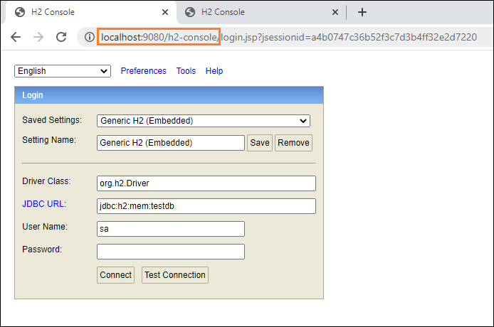
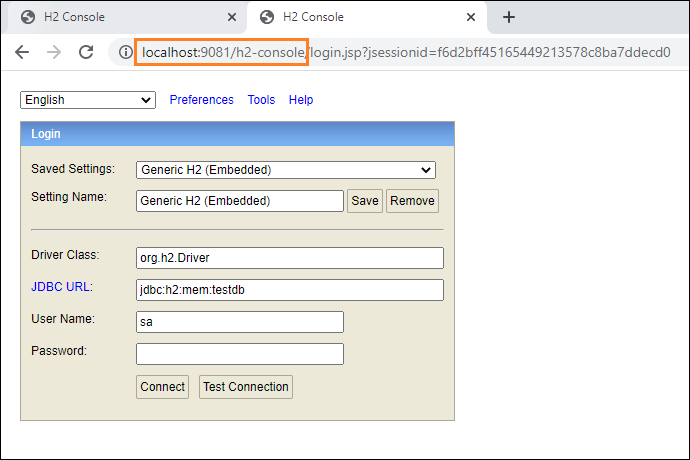
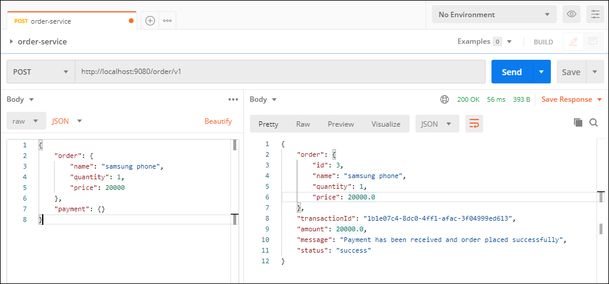
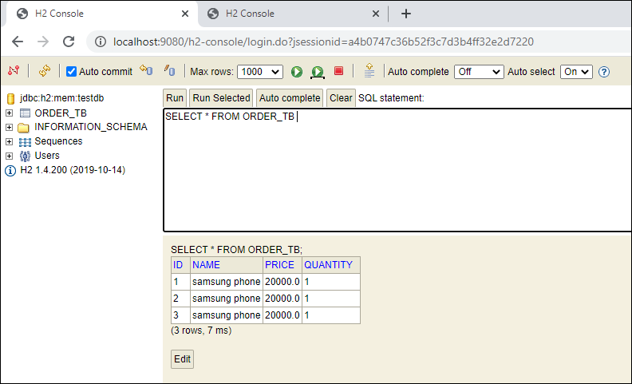
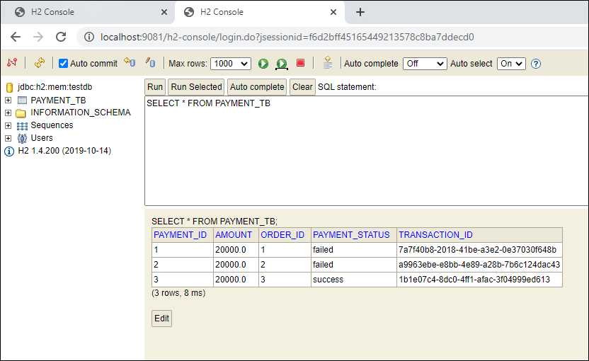

# Microservice communication - Getting Started

This project has two services -

* order-service 
  (https://github.com/deepakbhalla/microservices-full-pack-examples/tree/master/microservices_getting_started/order-service)
* payment-service 
  (https://github.com/deepakbhalla/microservices-full-pack-examples/tree/master/microservices_getting_started/payment-service)

## Order service 
- Accepts the order request and updates ORDER_TB table which is present in h2 database of this service.
- Makes a call to Payment Service which acts as 'payment gateway' to make a payment against this order.

## Payment Service
- Accepts a call from Order Service or any other client.
- Processes payment against the order in request
- Send back response with payment status, transaction id and other details back to the calling service/client.

## Testing Screenshots

* H2 Database of Order Service

* H2 Database of Payment Service

* Order Service Call Request (which internally calls Payment Service)

* H2 Database of Order Service post order has been placed

* H2 Database of Payment Service post Payment has been processed

